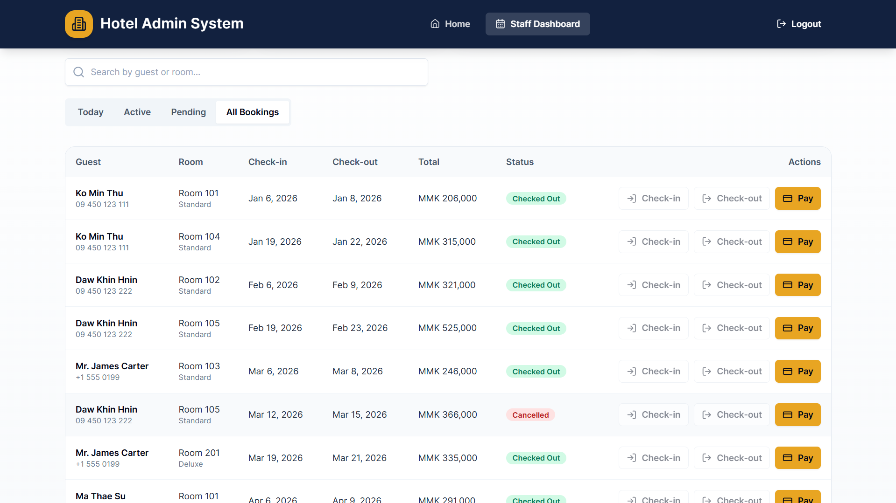

# Hotel Admin System

A complete full-stack hotel administration project built with Next.js App Router, TypeScript, Tailwind CSS, Prisma ORM, PostgreSQL, Zod, React Hook Form, Zustand, bcryptjs, jose JWT sessions, lucide-react, date-fns, sonner, and Recharts.

The system supports public room browsing and booking, custom credentials authentication, admin room/guest/booking management, receptionist check-in/check-out workflow, payments, and real database-backed reports.

## Screenshots

### 1. Public Guest Experience

#### Home Screen
> Public landing page displaying hotel highlights, tonight's availability statistics, and navigation options.


#### Explore Rooms & Filter
> Room browsing section with live category and status filtering dropdowns, capacity indicators, and nightly pricing.


#### Book a Room by Guest
> Reservation dialog for public guests to enter their stay dates, contact information, and special requests.


---

### 2. Authentication

#### Admin & Receptionist Login
> Unified login portal with quick-fill demo credentials for administrators and front desk staff.


---

### 3. Admin Dashboard

#### Room Management
> Full hotel inventory list with real-time status badges, capacity, pricing, and administrative controls.


#### Add a New Room
> Modal form for configuring and publishing new room numbers, room categories, pricing, and descriptions.


#### Guest Directory
> Centralized guest CRM database with searchable names, phone numbers, email addresses, and home cities.


#### Add a Guest
> Modal dialog to register a new guest profile directly from the administrative portal.


#### Bookings Oversight
> Comprehensive booking log showing guest information, allocated room, stay duration, total invoice, and status.


#### Create a Booking for Selected Guest
> Modal interface enabling administrators to create verified reservations for existing guests with automatic availability check.


#### Reports - Daily / Monthly Filter
> Reporting controls to filter revenue and reservation analytics by date range and grouping frequency.


#### Monthly Revenue & Analytics Reports
> Interactive business analytics displaying revenue by room type, occupancy trends, and financial summaries.


---

### 4. Staff / Receptionist Dashboard

#### Today's Check-ins
> Front desk operational view tracking arrivals and check-ins scheduled for the current day.


#### Active In-House Guests
> Real-time monitoring of guests currently checked into rooms with quick check-out and billing actions.


#### Pending Arrivals Tab
> List of confirmed and upcoming reservations awaiting guest arrival.


#### Record Payment
> Fast payment processing dialog to record settlements via cash, card, mobile pay, or bank transfer.


#### All Bookings Roster
> Front desk overview of all historical, current, and future reservations with status badges.




## Included stack

- Next.js App Router
- TypeScript
- Tailwind CSS
- Prisma ORM
- PostgreSQL
- Zod validation
- React Hook Form
- Zustand for UI state only
- bcryptjs password hashing
- jose JWT session in secure HTTP-only cookie
- lucide-react icons
- date-fns date utilities
- sonner toasts
- recharts reports

## Setup commands

```bash
cd hotel-administration-system
cp .env.example .env
npm install
docker compose up -d
npm run db:generate
npm run db:push
npm run db:seed
```

## Run commands

```bash
npm run dev
```

Open the app at `http://localhost:3000`.

For production-style local run:

```bash
npm run build
npm run start
```

## Login accounts

| Role | Email | Password |
| --- | --- | --- |
| Admin | admin@hotel.com | password123 |
| Receptionist | receptionist@hotel.com | password123 |

## Main routes

- `/` public landing page and room booking
- `/login` credentials login
- `/admin` admin dashboard
- `/staff` receptionist dashboard

## API routes

- `POST /api/auth/login`
- `POST /api/auth/logout`
- `GET /api/auth/me`
- `GET /api/rooms`
- `POST /api/rooms`
- `GET /api/rooms/[id]`
- `PATCH /api/rooms/[id]`
- `DELETE /api/rooms/[id]`
- `GET /api/guests`
- `POST /api/guests`
- `GET /api/guests/[id]`
- `PATCH /api/guests/[id]`
- `DELETE /api/guests/[id]`
- `GET /api/bookings`
- `POST /api/bookings`
- `GET /api/bookings/[id]`
- `PATCH /api/bookings/[id]`
- `POST /api/bookings/availability`
- `POST /api/bookings/check-in`
- `POST /api/bookings/check-out`
- `GET /api/payments`
- `POST /api/payments`
- `GET /api/reports/summary`

## Test checklist

1. Start PostgreSQL with `docker compose up -d`.
2. Run Prisma setup and seed commands.
3. Open `/` and verify rooms load from the database.
4. Use search, type filter, and status filter on the landing page.
5. Book an available room as a public guest.
6. Login as admin and verify `/admin` loads.
7. Create, edit, and delete a room without existing bookings.
8. Create and edit a guest.
9. Create a booking and use availability check.
10. Try booking the same room for overlapping dates and verify it is blocked.
11. Open reports and verify revenue/status/occupancy data.
12. Login as receptionist and verify `/staff` loads.
13. Try visiting `/admin` as receptionist and verify redirect to `/staff`.
14. Use check-in, check-out, and record payment actions.
15. Logout and verify protected routes require login.

## Known limitations

- The project uses local PostgreSQL via Docker Compose and is not preconfigured for a hosted production database.
- Room category CRUD is represented through seeded categories and room category selection, not a separate category management screen.
- Payment invoices are recorded as transactions but PDF invoice export is not included.
- Concurrent double-booking protection is implemented at the application validation layer; production deployments should add database-level locking or exclusion constraints for very high concurrency.
