# Hotel Admin System

A complete full-stack hotel administration project built with Next.js App Router, TypeScript, Tailwind CSS, Prisma ORM, PostgreSQL, Zod, React Hook Form, Zustand, bcryptjs, jose JWT sessions, lucide-react, date-fns, sonner, and Recharts.

The system supports public room browsing and booking, custom credentials authentication, admin room/guest/booking management, receptionist check-in/check-out workflow, payments, and real database-backed reports.

## Screenshots

### 1. Public Guest Experience

#### Public Landing Page & Room Showcase
> Guests can browse real-time room availability, filter by room category and status, and view room specifications and nightly pricing.

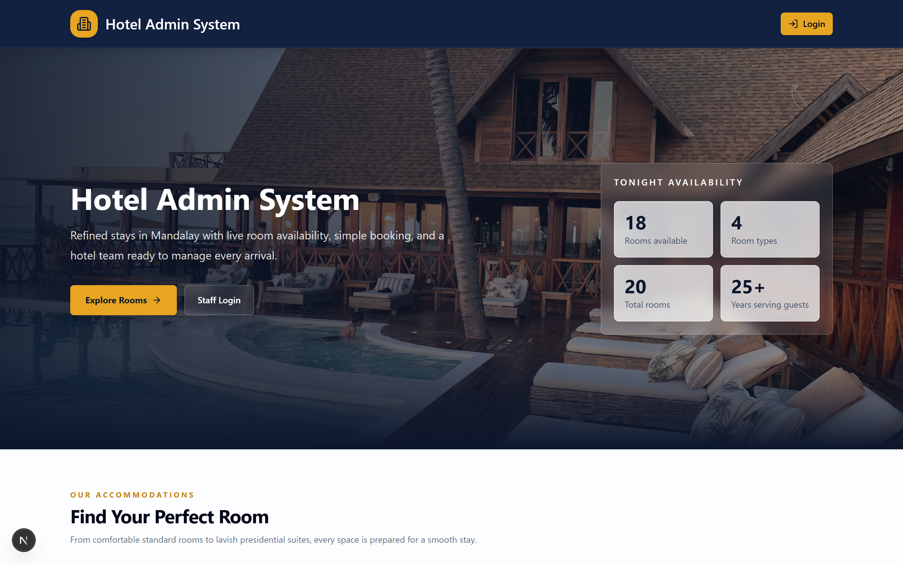

#### Room Booking Modal
> Interactive reservation modal allowing guests to input booking dates, guest contact information, and special notes with automated availability validation.

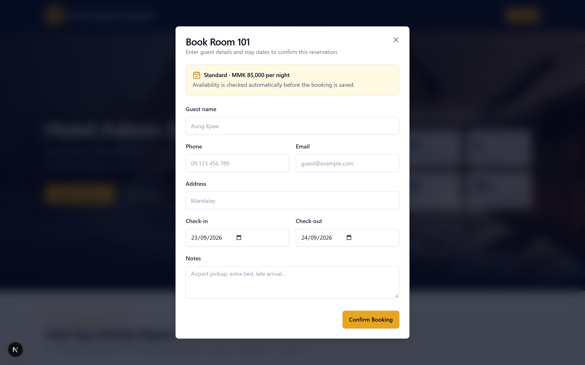

---

### 2. Authentication & Security

#### Role-Based Login Screen
> Secure credential authentication supporting Admin and Receptionist roles with demo login presets for quick evaluation.

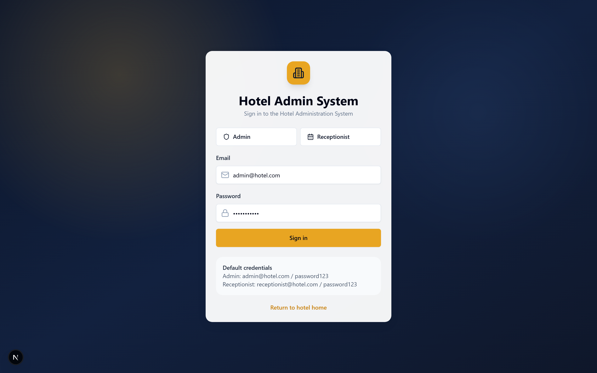

---

### 3. Admin Dashboard

#### Room Inventory Management
> Comprehensive room roster with status indicators, capacity, nightly rates, search and category filtering, and direct edit/delete controls.

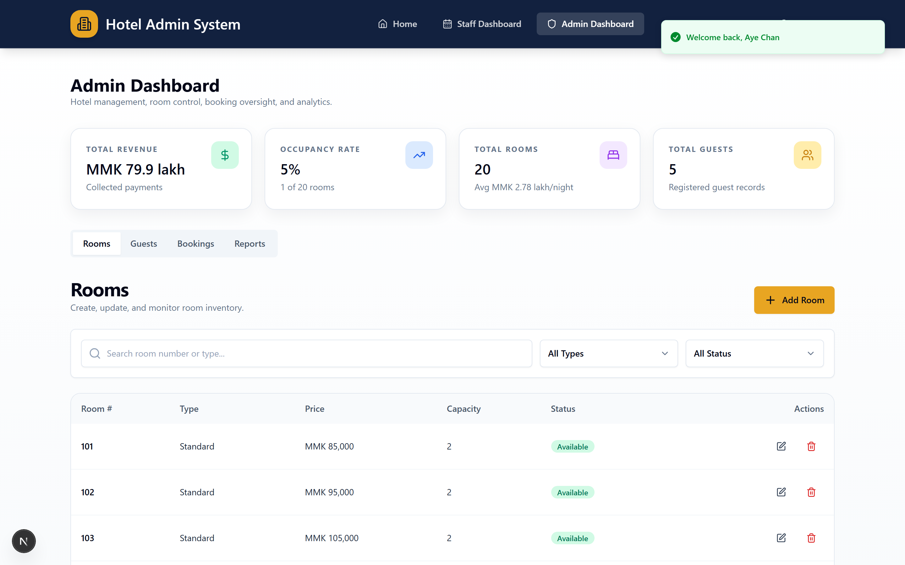

#### Add / Edit Room Modal
> Dedicated modal for administrators to configure room numbers, room types, pricing, capacity, and descriptions.

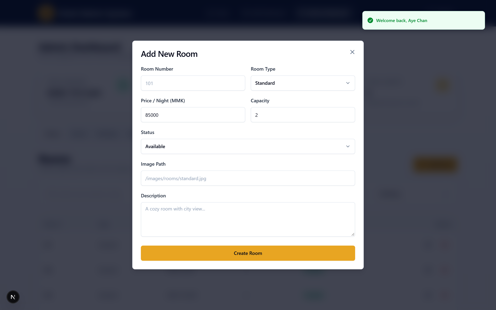

#### Guest Management & Directory
> Centralized guest CRM database displaying registered guest profiles, contact numbers, email addresses, and locations.

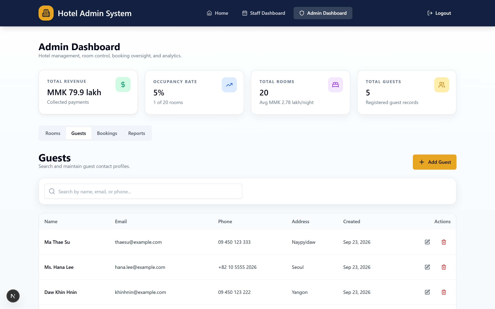

#### Booking Oversight
> Complete oversight of all reservations across the hotel with status tracking (Confirmed, Checked In, Checked Out, Cancelled) and edit/cancellation actions.

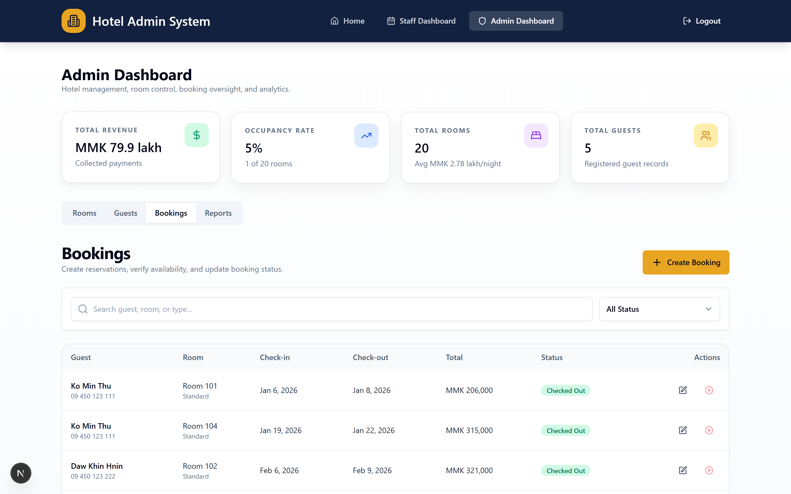

#### Reports & Business Analytics
> Financial and operational metrics including total revenue, occupancy rate, room type breakdown, date-range filtering, and visual charts powered by Recharts.

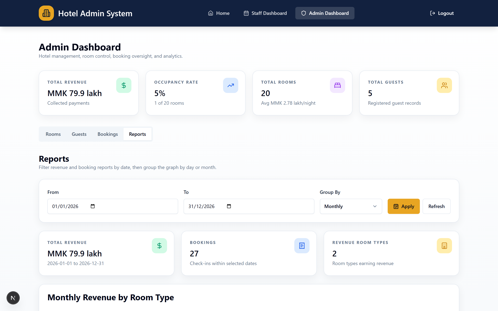

---

### 4. Receptionist / Front Desk Dashboard

#### Daily Operations & Today's Arrivals
> Front desk overview showing today's expected check-ins, currently in-house guests, and pending arrivals.

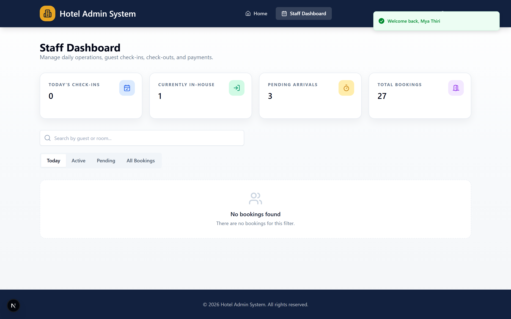

#### In-House Active Guests
> Real-time list of guests currently residing in the hotel with quick check-out and payment collection triggers.

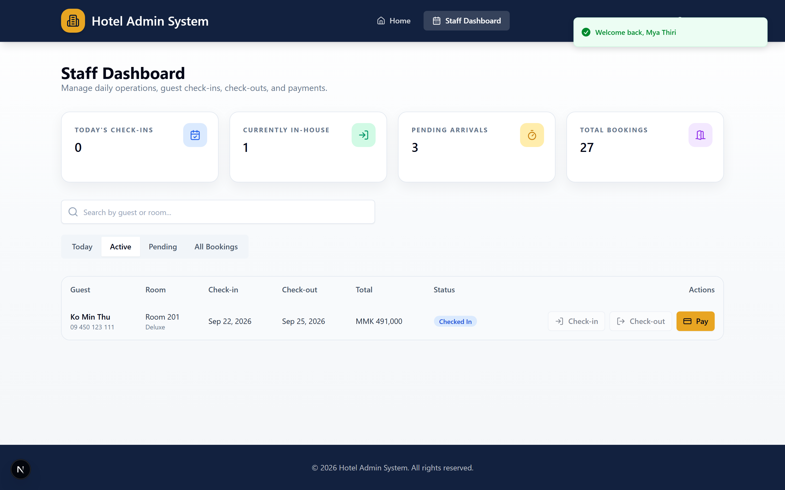

#### Full Booking Operations
> Comprehensive front desk view for all historical and upcoming bookings with status badges and quick action buttons.

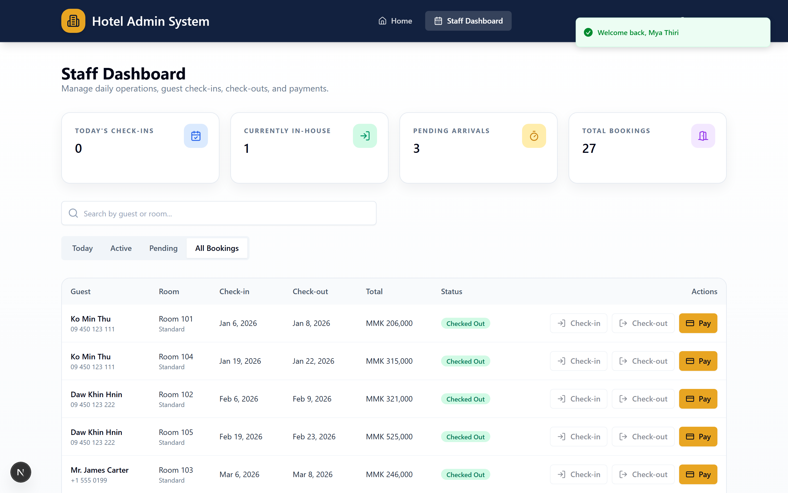

#### Payment Processing Dialog
> Instant payment recording modal allowing front desk staff to collect payments across multiple methods (Cash, Card, Bank Transfer, Mobile Pay).

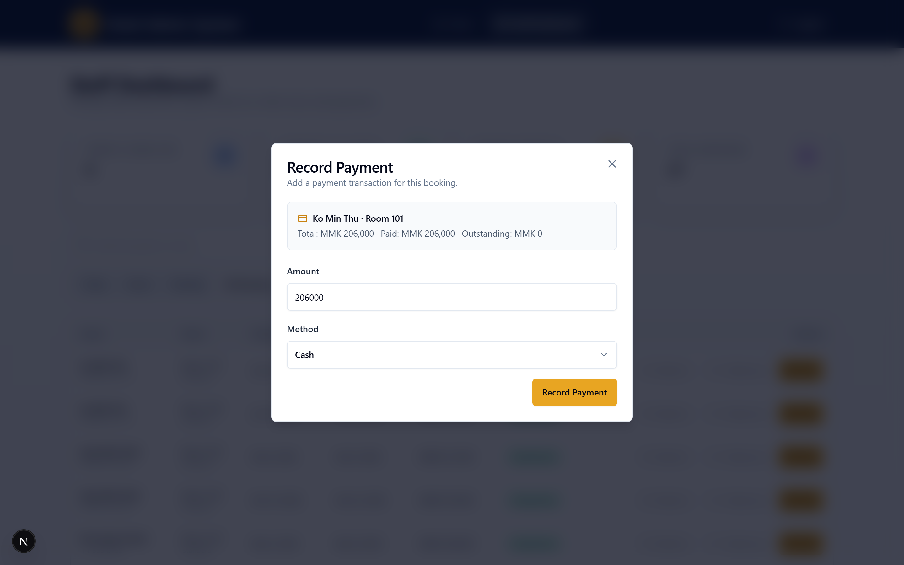


## Included stack

- Next.js App Router
- TypeScript
- Tailwind CSS
- Prisma ORM
- PostgreSQL
- Zod validation
- React Hook Form
- Zustand for UI state only
- bcryptjs password hashing
- jose JWT session in secure HTTP-only cookie
- lucide-react icons
- date-fns date utilities
- sonner toasts
- recharts reports

## Setup commands

```bash
cd hotel-administration-system
cp .env.example .env
npm install
docker compose up -d
npm run db:generate
npm run db:push
npm run db:seed
```

## Run commands

```bash
npm run dev
```

Open the app at `http://localhost:3000`.

For production-style local run:

```bash
npm run build
npm run start
```

## Login accounts

| Role | Email | Password |
| --- | --- | --- |
| Admin | admin@hotel.com | password123 |
| Receptionist | receptionist@hotel.com | password123 |

## Main routes

- `/` public landing page and room booking
- `/login` credentials login
- `/admin` admin dashboard
- `/staff` receptionist dashboard

## API routes

- `POST /api/auth/login`
- `POST /api/auth/logout`
- `GET /api/auth/me`
- `GET /api/rooms`
- `POST /api/rooms`
- `GET /api/rooms/[id]`
- `PATCH /api/rooms/[id]`
- `DELETE /api/rooms/[id]`
- `GET /api/guests`
- `POST /api/guests`
- `GET /api/guests/[id]`
- `PATCH /api/guests/[id]`
- `DELETE /api/guests/[id]`
- `GET /api/bookings`
- `POST /api/bookings`
- `GET /api/bookings/[id]`
- `PATCH /api/bookings/[id]`
- `POST /api/bookings/availability`
- `POST /api/bookings/check-in`
- `POST /api/bookings/check-out`
- `GET /api/payments`
- `POST /api/payments`
- `GET /api/reports/summary`

## Test checklist

1. Start PostgreSQL with `docker compose up -d`.
2. Run Prisma setup and seed commands.
3. Open `/` and verify rooms load from the database.
4. Use search, type filter, and status filter on the landing page.
5. Book an available room as a public guest.
6. Login as admin and verify `/admin` loads.
7. Create, edit, and delete a room without existing bookings.
8. Create and edit a guest.
9. Create a booking and use availability check.
10. Try booking the same room for overlapping dates and verify it is blocked.
11. Open reports and verify revenue/status/occupancy data.
12. Login as receptionist and verify `/staff` loads.
13. Try visiting `/admin` as receptionist and verify redirect to `/staff`.
14. Use check-in, check-out, and record payment actions.
15. Logout and verify protected routes require login.

## Known limitations

- The project uses local PostgreSQL via Docker Compose and is not preconfigured for a hosted production database.
- Room category CRUD is represented through seeded categories and room category selection, not a separate category management screen.
- Payment invoices are recorded as transactions but PDF invoice export is not included.
- Concurrent double-booking protection is implemented at the application validation layer; production deployments should add database-level locking or exclusion constraints for very high concurrency.
